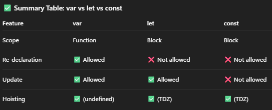
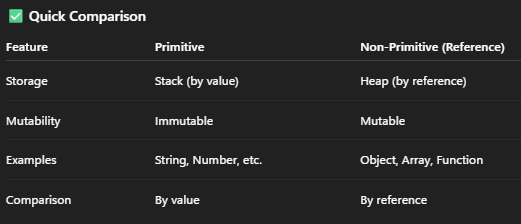

## Variables
- variables are the containers to store the data
- It can be declared using `var`,`let` or `const`.
### var
- Function Scoped
- can be declared and can be updated
- Hoisted, but initialized ad `undefined`.
```js
    var x = 10;
    var x = 20; // ✅ re-declaration allowed
    console.log(x); // 20
```
### let
- Block-scoped
- Cannot be re-declared in same scope, but can be updated
- `let` and `const` are hoisted but remains in the **Temporal Dead Zone (TDZ)** until its actually initialized, such they cannot be accessed before declaration.if tried to access before initialization it throws `Refrence Error`.
```js
    let y = 10;
    // let y = 20; ❌ Error
    y = 30; // ✅ update allowed
```
### const
- Block-scoped
- cannot be redeclared or updated
- must be initialized at declaration
```js
    const z = 50;
    // z = 60; ❌ Error
```
- **NOTE:_**For object and array declared using `const`, the reference cannot changed. but, the values inside it can be updated.

## DataTypes
- DataTypes are 
- Divided into 2 types
  - Primitive. Immutable, stored by value
    - String → "Hello"
    - Number → 10, 3.14, NaN, Infinity
    - BigInt → 123456789012345678901234567890n
    - Boolean → true / false
    - Undefined → Variable declared but not assigned
    - Null → Explicit "no value"
    - Symbol → Unique and immutable value (ES6)
    ```js
        let str = "Hello";     // String
        let num = 42;          // Number
        let big = 123n;        // BigInt
        let isOk = true;       // Boolean
        let notDefined;        // Undefined
        let empty = null;      // Null
        let sym = Symbol("id");// Symbol
    ```
  - NonPrimitive(Reference). Mutable, which can be stored by the refrence in the memory(heap).
    - Object
      - `let person = { name:"Aawni", age:30}`
    - Array
      - `let nums = [1,2,3]`
    - Function
      - `function greet(){ return "Hello" }`
    - Date, RegExp, Map, Set, WeakMap, WeakSet (built-in objects)
    ```js
        // Primitive (by value)
        let a = 10;
        let b = a;
        b = 20;
        console.log(a); // 10 (unchanged)

        // Non-Primitive (by reference)
        let obj1 = { name: "Aawni" };
        let obj2 = obj1;
        obj2.name = "Kiran";
        console.log(obj1.name); // Kiran (both point to same reference)
    ```
  
## Summary



<hr><hr>

## __iPrepQuestions
### Stack vs Heap
- Stack
  - stored by value, where each variable directly holds its value.
  - Here, changing one variable doesn't affect the others.
  - Primitives(Number, String, Boolean etc..), gets stored directly in stack by value.
- Heap
  - variables hold the referene(address/pointer)
  - where the actual object/array is stored in heap memory.
  - If two variables point to same object, updating one may affects the other.=> Changes are reflect in both
  - NonPrimitives(Objects, Arrays, Functions), where the variables in stack stores the reference(pointer) to data in heap.

### What are JavaScript primitive, non-primitive (reference) data types?
### Difference between `var`, `let`, and `const`?
### What happens if we re-declare a variable with `var`?
### Can we reassign the `const` object?
### Difference between `null` and `undefined` and `NaN`?
### Why does `typeof null` return "object"?
### How do you check the type of a variable?
### What is type coercion?